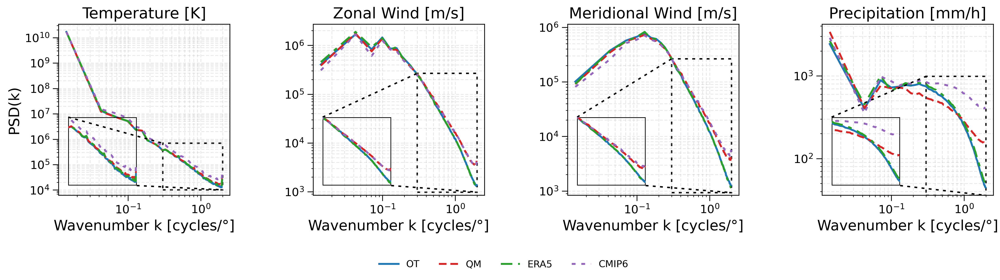
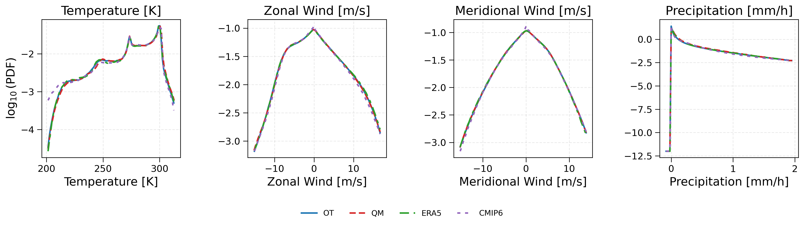
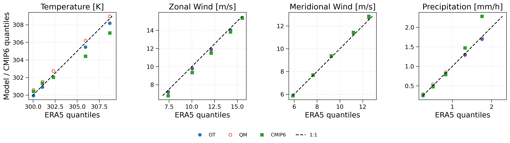

Benchmark
=========

This section presents a benchmark of the two bias-correction methods implemented
in AID-BC: Quantile Mapping (QM) and Optimal Transport (OT).

The corrected distributions are compared against ERA5, which is used as the
reference dataset, while the uncorrected CMIP6 simulation is shown as the
baseline. The benchmark is performed for four surface variables:

* 2-m temperature (``VAR_2T``),
* 10-m zonal wind (``VAR_10U``),
* 10-m meridional wind (``VAR_10V``),
* precipitation (``VAR_TP``).

For precipitation, ``VAR_TP`` represents a 3-hour mean precipitation rate.
CMIP6 provides a 3-hour mean precipitation flux, while ERA5 hourly
precipitation accumulations are aggregated over the corresponding 3-hour
period and converted to the same units (m h\ :sup:`-1`). This ensures a
consistent precipitation definition between the two datasets.

The diagnostics shown below are computed over the 2021 application period.

Methods
~~~~~~~

Two methods are available:

``qm``
   Quantile Mapping. This method is univariate and therefore accepts exactly
   one climate variable. Each variable is corrected independently.

``ot``
   Optimal Transport. This method accepts one or several climate variables.
   All requested variables and spatial grid points are concatenated into a
   common feature space and transported jointly.

Split modes
~~~~~~~~~~~

Two fitting strategies are available:

``none``
   Fit one corrector using all training samples.

``month``
   Fit one separate corrector for each calendar month. This can better preserve
   seasonality and substantially reduce the number of samples involved in each
   OT problem.

For this benchmark, both QM and OT use the ``month`` split mode. Therefore,
twelve independent bias-correction mappings are fitted, one for each calendar
month.

Optimal Transport configuration
~~~~~~~~~~~~~~~~~~~~~~~~~~~~~~~~

The OT experiment uses the following parameters:

.. code-block:: text

   ot_epsilon    = 1
   ot_threshold  = 0.1
   ot_batch_size = 16
   ot_dtype      = float64

The four variables are corrected jointly in the OT experiment, whereas the QM
experiments are performed independently for each variable.

Power spectral density
~~~~~~~~~~~~~~~~~~~~~~

The power spectral density (PSD) measures how spatial variance is distributed
across scales. Low wavenumbers represent large-scale structures, while high
wavenumbers correspond to finer spatial variability.

For temperature, the four spectra are very similar over most of the resolved
wavenumber range, with only small differences at the finest spatial scales.

The same pattern is observed for the zonal and meridional wind components.
At large and intermediate scales, QM and OT both follow ERA5 closely. At the
finest scales, however, OT remains better aligned with ERA5, while QM stays
closer to the uncorrected CMIP6 spectrum.

Precipitation shows the clearest differences between the methods. The raw
CMIP6 spectrum departs strongly from ERA5 at fine scales. Both corrections
modify this behaviour, but OT follows the ERA5 spectral decay more closely
than QM.

Overall, the main differences between QM and OT appear at the finest spatial
scales, especially for precipitation.

Probability density functions
~~~~~~~~~~~~~~~~~~~~~~~~~~~~~

The probability density functions compare the marginal distributions of ERA5,
raw CMIP6, QM-corrected CMIP6 and OT-corrected CMIP6. The vertical axis shows
the base-10 logarithm of the estimated probability density in order to make
differences in the distribution tails more visible.

For the two wind components, all four distributions are very similar, with only
small differences across the range.

For temperature, the main differences appear in the lower tail. Raw CMIP6
departs from ERA5 at low temperatures, while both QM and OT bring the
distribution closer to the reference.

For precipitation, the four distributions are also very similar over most of
the range, and the differences between CMIP6, QM, OT and ERA5 remain limited in
the PDF representation.

Quantile--quantile comparison
~~~~~~~~~~~~~~~~~~~~~~~~~~~~~

The quantile--quantile (QQ) plots compare selected upper quantiles against the
corresponding ERA5 values. The quantiles shown are 0.90, 0.95, 0.975, 0.99 and
0.995.

ERA5 quantiles are shown on the horizontal axis, while the corresponding
CMIP6, QM and OT quantiles are shown on the vertical axis. The dashed black
line represents the ideal 1:1 relationship.

For temperature, QM is very closely aligned with the 1:1 line across all
quantiles and is closer to the ERA5 reference than OT, especially for the
highest quantiles. This is expected, since QM directly corrects the marginal
quantiles of each variable.

For the wind components, both QM and OT remain close to the ERA5 reference,
with only small differences between the methods and the raw CMIP6 data.

For precipitation, both correction methods reduce the deviation from ERA5
observed in raw CMIP6. QM is slightly closer to the 1:1 line for the first
two quantiles, while QM and OT give very similar results for the higher
quantiles.

Summary
~~~~~~~

The three diagnostics highlight complementary aspects of the bias correction:

* the PDF evaluates the marginal distribution of each variable,
* the QQ plots focus on selected upper quantiles,
* the PSD evaluates the spatial variability across scales.

Both QM and OT improve the agreement between CMIP6 and ERA5, but their
strengths appear in different diagnostics.

QM performs particularly well in the QQ comparison, which is expected because
it directly targets the marginal quantile distribution. OT, on the other hand,
shows a stronger ability to reproduce the ERA5 spatial spectrum at the finest
scales, especially for the wind components and precipitation.

These differences are important for our application, where the corrected CMIP6
fields are used as inputs to the IPSL-AID diffusion model for climate
downscaling.

OT is better suited to this workflow because it corrects the variables jointly
and better preserves the ERA5 spatial variability at fine scales. In contrast,
QM corrects each variable independently and mainly targets marginal quantiles.

Optimal Transport is therefore selected as the preferred bias-correction
method for the IPSL-AID climate downscaling experiments.
