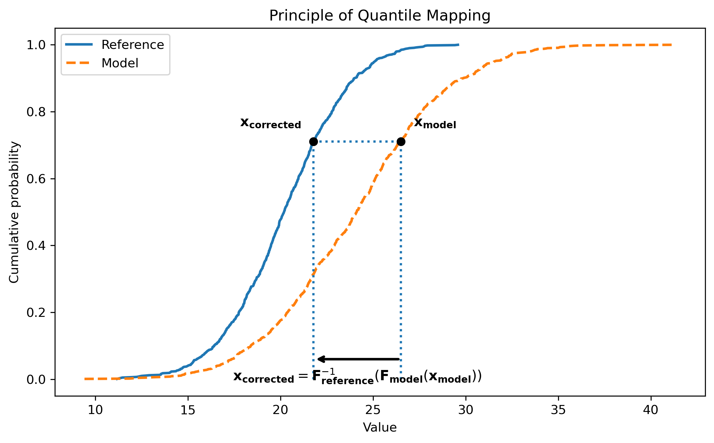

Quantile Mapping
================

Quantile Mapping is the current bias-correction method implemented in AID-BC.

It is used to reduce systematic distributional differences between CMIP6 climate
model outputs and a reference dataset. In the current workflow, ERA5 is used as
the reference dataset, and CMIP6 data are corrected so that their statistical
distribution becomes closer to the ERA5 distribution over a chosen training
period.

The corrected CMIP6 fields can then be used as large-scale inputs for AI-based
downscaling experiments.

Purpose
-------

Climate model outputs often contain systematic biases compared with reference
datasets or reanalysis products. These biases can affect downstream workflows,
especially when climate variables are used as inputs to AI-based downscaling
models.

Quantile Mapping aims to correct these biases by matching the distribution of a
biased model variable to the distribution of a reference variable.

In AID-BC, this method is used to learn a statistical relationship between
CMIP6 and ERA5 over a training period, then apply this relationship to a target
CMIP6 application period.

General principle
-----------------

Quantile Mapping corrects a value by comparing its position in the distribution
of the biased model data and mapping it to the corresponding value in the
reference distribution.

The principle is illustrated in the figure below using a simplified example with
a model distribution and a reference distribution.

   Illustration of the Quantile Mapping principle. The model value is first
   converted into a cumulative probability using the model CDF. The corrected
   value is then obtained from the reference CDF at the same cumulative
   probability.

In this example, the value to be corrected is denoted by ``x_model``. Its
position in the model distribution is first identified through the model
cumulative distribution function:

.. math::

   q = F_{model}(x_{model})

where ``q`` is the quantile associated with ``x_model``.
The same quantile is then used in the reference distribution to
obtain the corrected value:

.. math::

   x_{corrected} = F^{-1}_{reference}(q)

Combining these two steps gives:

.. math::

   x_{corrected} = F^{-1}_{reference}(F_{model}(x_{model}))

This means that the corrected value keeps the rank information from the model
distribution while adopting the value scale of the reference distribution.

Applied to the CMIP6--ERA5 bias-correction framework, the model distribution is
the CMIP6 training distribution, and the reference distribution is the ERA5
training distribution. For a given CMIP6 value, the method first determines the
quantile of that value within the CMIP6 training distribution. It then finds the
ERA5 value corresponding to the same quantile.

Conceptually, the correction can therefore be written as:

.. math::

   x_{corrected} = F^{-1}_{ERA5}(F_{CMIP6}(x_{CMIP6}))

where:

- ``x_CMIP6`` is the original CMIP6 value,
- ``F_CMIP6`` is the cumulative distribution function of the CMIP6 training
  data,
- ``F^{-1}_ERA5`` is the inverse cumulative distribution function of the ERA5
  training data,
- ``x_corrected`` is the bias-corrected CMIP6 value.

Therefore, the corrected CMIP6 value preserves its relative rank in the CMIP6
distribution while being expressed on the ERA5 reference scale.

Training and application periods
--------------------------------

The Quantile Mapping workflow separates the data into two periods.

1. Training period
~~~~~~~~~~~~~~~~~~

The training period is used to estimate the statistical relationship between
CMIP6 and ERA5.

During this step, AID-BC uses:

- ERA5 reference data for the training period,
- preprocessed CMIP6 data for the same training period.

Both datasets must be defined on the same latitude-longitude grid. In the
current workflow, this is achieved during preprocessing, where CMIP6 data are
interpolated onto the ERA5 grid and stored as Zarr files.

2. Application period
~~~~~~~~~~~~~~~~~~~~~

The application period is the period to which the learned correction is applied.

During this step, AID-BC uses preprocessed CMIP6 application data and applies
the Quantile Mapping transformation learned from the training period.

The application period can correspond to:

- a historical period not used during training,
- a validation or test period,
- a future CMIP6 simulation period.

The corrected output is saved as a NetCDF file.

Inputs and outputs
------------------

The Quantile Mapping step uses three main inputs:

- ERA5 training data stored as NetCDF files,
- preprocessed CMIP6 training data stored as Zarr files,
- preprocessed CMIP6 application data stored as Zarr files.

The ERA5 data provide the reference distribution. The CMIP6 training data
provide the biased model distribution over the same period. The CMIP6
application data are the values to be corrected.

The output is a corrected CMIP6 field saved as a NetCDF file. This corrected
field is intended to be used as input for downstream AI-based downscaling
experiments.

Current implementation
----------------------

The current implementation uses univariate Quantile Mapping.

This means that each variable is corrected independently. The correction is
based on the distribution of a single variable at a time and does not explicitly
correct dependencies between several variables.

For example, temperature and wind components are corrected independently when
they are included in the workflow.

This approach is useful for reducing marginal distributional biases, but it does
not guarantee that physical or statistical dependencies between variables are
fully preserved.

Limitations
-----------

Although Quantile Mapping is widely used and effective for correcting
distributional biases, it has some limitations.

In its current univariate form, Quantile Mapping:

- corrects each variable independently,
- does not explicitly preserve multivariate dependencies.

These limitations motivate future extensions of AID-BC toward multivariate
bias-correction methods.
