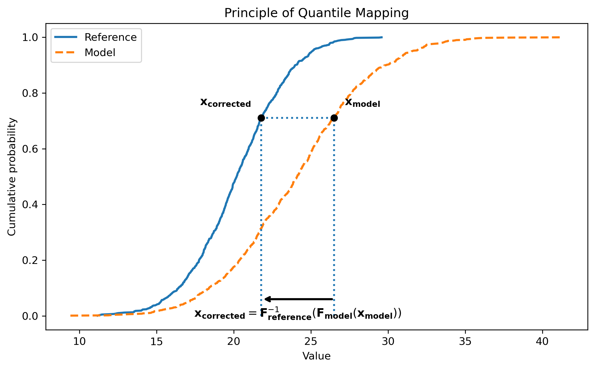

Quantile Mapping
================

Quantile Mapping is a univariate bias-correction method used in AID-BC to reduce
systematic distributional differences between CMIP6 climate model outputs and
ERA5 reference data.

The method is fitted over a selected training period and then applied to a CMIP6
application period. The corrected CMIP6 fields can subsequently be used as
large-scale inputs for AI-based downscaling experiments.

Purpose
-------

Climate model outputs often contain systematic biases compared with reference
datasets or reanalysis products.

Quantile Mapping corrects these biases by matching the distribution of a biased
model variable to the distribution of a reference variable while preserving the
relative rank of the model values.

General principle
-----------------

Quantile Mapping corrects a value by comparing its position in the distribution
of the biased model data and mapping it to the corresponding value in the
reference distribution.

The principle is illustrated in the figure below using a simplified example with
a model distribution and a reference distribution.

   Illustration of the Quantile Mapping principle. The model value is first
   converted into a cumulative probability using the model CDF. The corrected
   value is then obtained from the reference CDF at the same cumulative
   probability.

In this example, the value to be corrected is denoted by ``x_model``. Its
position in the model distribution is first identified through the model
cumulative distribution function:

.. math::

   q = F_{model}(x_{model})

where ``q`` is the quantile associated with ``x_model``.
The same quantile is then used in the reference distribution to
obtain the corrected value:

.. math::

   x_{corrected} = F^{-1}_{reference}(q)

Combining these two steps gives:

.. math::

   x_{corrected} = F^{-1}_{reference}(F_{model}(x_{model}))

This means that the corrected value keeps the rank information from the model
distribution while adopting the value scale of the reference distribution.

Applied to the CMIP6--ERA5 bias-correction framework, the model distribution is
the CMIP6 training distribution, and the reference distribution is the ERA5
training distribution. For a given CMIP6 value, the method first determines the
quantile of that value within the CMIP6 training distribution. It then finds the
ERA5 value corresponding to the same quantile.

Conceptually, the correction can therefore be written as:

.. math::

   x_{corrected} = F^{-1}_{ERA5}(F_{CMIP6}(x_{CMIP6}))

where:

- ``x_CMIP6`` is the original CMIP6 value,
- ``F_CMIP6`` is the cumulative distribution function of the CMIP6 training
  data,
- ``F^{-1}_ERA5`` is the inverse cumulative distribution function of the ERA5
  training data,
- ``x_corrected`` is the bias-corrected CMIP6 value.

Therefore, the corrected CMIP6 value preserves its relative rank in the CMIP6
distribution while being expressed on the ERA5 reference scale.

Training and application periods
--------------------------------

The Quantile Mapping workflow separates the data into two periods.

1. Training period
~~~~~~~~~~~~~~~~~~

The training period is used to estimate the statistical relationship between
ERA5 and historical CMIP6 data.

Both datasets must be represented on the same latitude-longitude grid. In the
current AID-BC workflow, correction is performed on the native CMIP6 grid. ERA5
data are therefore either prepared onto the CMIP6 grid during the workflow or
loaded from previously prepared ERA5-on-CMIP6 files.

2. Application period
~~~~~~~~~~~~~~~~~~~~~

The application period contains the CMIP6 data to be corrected using the fitted
mapping.

It can correspond to:

- a historical period not used during training,
- a validation or test period,
- a future CMIP6 simulation period.

Corrected fields are reconstructed on the native CMIP6 grid and saved as yearly
NetCDF files.

Current implementation
----------------------

AID-BC implements Quantile Mapping as a univariate bias-correction method.

Exactly one climate variable is corrected during each Quantile Mapping
experiment. The selected ERA5 and CMIP6 fields are represented on the native
CMIP6 grid and reshaped from:

.. code-block:: text

   (time, latitude, longitude)

to:

.. code-block:: text

   (time, latitude * longitude)

before fitting.

AID-BC can fit either:

- one Quantile Mapping corrector using all training samples,
- one independent Quantile Mapping corrector for each calendar month.

Limitations
-----------

Quantile Mapping in AID-BC is univariate.

It corrects the marginal distribution of one climate variable at a time and
does not explicitly model dependencies between several variables.

As a result, relationships between variables such as temperature and wind
components are not jointly corrected.

The method also assumes that the statistical relationship estimated during the
training period remains applicable during the application period.
